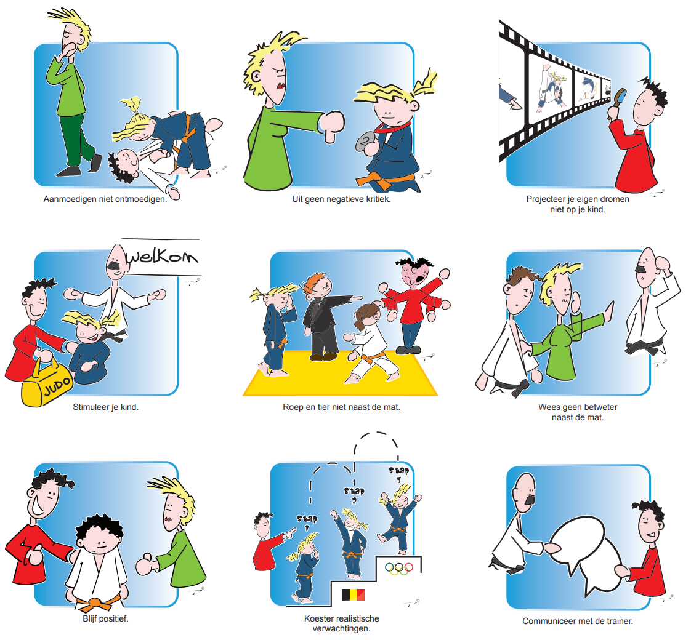
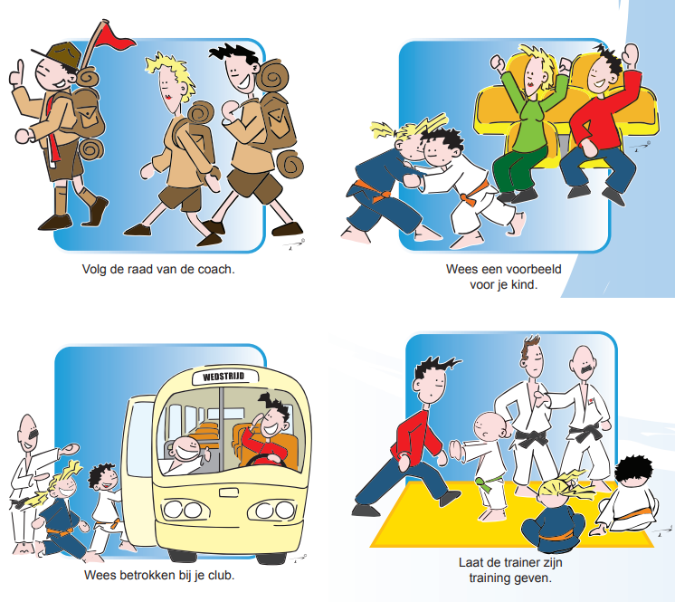

Een overzicht van de gedragscodes, die een meer gedetailleerde aanvulling zijn bij de “[Eed van de judoka](/about/filosofie)” die elke judoka elk jaar opnieuw meekrijgt en bij lidmaatschap automatisch onderschrijft.

Er zijn gedragscodes voor judoka, ouders en trainers.

Al deze gedragscodes hangen ook uit in de club als poster.

## Judoka

## Ouders

## Trainer & Coach

