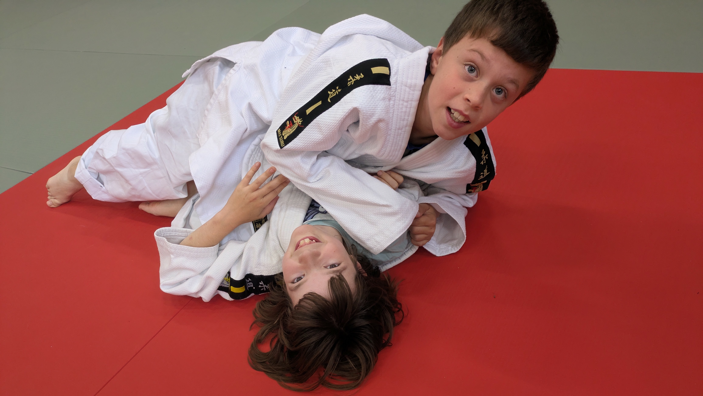

Dit zijn onze verschillende judogroepen. Ontdek welke groep het beste bij jou past en klik door voor meer informatie over lesuren, niveau en activiteiten.

## <a href="/groepen/kleuters">Kleuters (3-6 jaar)</a>

## <a href="/groepen/benjamins">Benjamins (6-8 jaar)</a>

## <a href="/groepen/jongeren">Jongeren (8-14 jaar)</a>

## <a href="/groepen/volwassenen">Volwassenen (14+)</a>

